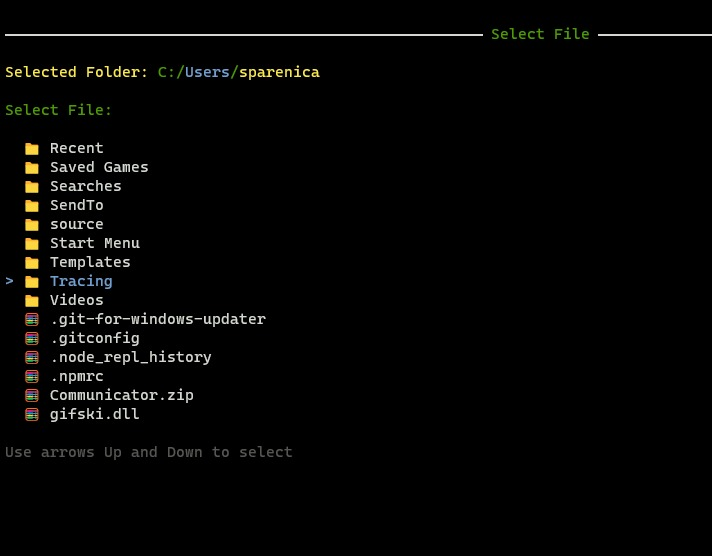
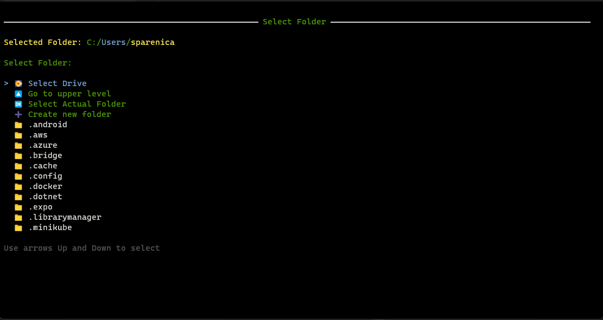

# File and Folder selector for 	[Spectre.Console](https://github.com/spectreconsole)

## Spectre.Console is the best - this is my huble try to make it even more usefull.

Thank you for your kind interest in this little helper. 

This library provides the functionality of the folder/file selector component for Spectre.Console packate which provides amazing tools for creating modern UI on the terminal 

## Browser.cs

### Constructor

The class consturctor `Browser()` doesn't take any paramaters.

### Properties 

`DisplayIcons` *boolean* default **true** Decides if the icons are displayed in the browser.

`PageSize` *integer* default **15** Decides how many items is displayed in the selector

`CanCreateFolder` *boolean* default is **true** Decides if creation of the new folder option is included for user

`ActualFolder` *string* default is *Documents* Can be setup to any path which will be used as Browser starting path

`SelectedFile` *boolean* decides if we are selecting File or the Directory

`LevelUpText` *string* default is **Go to upper level** sets string used in the navigation for selection to go at the parent level

`ActualFolderText` *string* default is **Selected Folder** sets string used in the navigator to name actual directory

`MoreChoicesText` *string* default is **Use arrows Up and Down to select** sets up hint text below the selector

`CreateNewText` *string* default is **Create new folder** 

`SelectFileText` *string* default is **Select File**

`SelectFolderText` *string* default is **Select Folder**

`SelectDriveText` *string* default is **Select Drive**

`SelectActualText` *string* Select Actual Folder

### Methods *Async*

`string GetPath(string ActualFolder, bool SelectFile)` displays the selector and returns  file or folder path depending on bool SelectFile value

`string GetFilePath()` displays the selector for a *File selection* in User's document folder. retuns string path value

`string GetFilePath(string ActualFolder)` displays the selector for a *File selection* in the folder given as the parameter

`string GetFolderPath()` displays the selector for a *Folder selection* in User's document folder

`string GetFolderPath(string ActualFolder)` displays the selector for a *Folder selection* in the folder given as the parameter

I tried to add many properties with texts and settings to make this tool customizable and possible to translate. 

